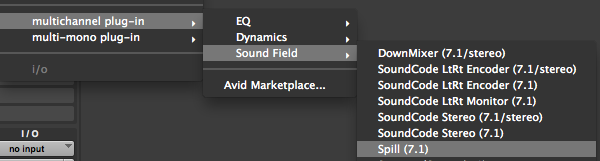

# Using the Spill Plug-In

Here is how to use the Spill Plug-in in Pro Tools.

* Create a multi-channel track. Spill can be used on a stereo track up to a 7.1 multi-channel track.
* Click on the insert slot for the track and select multichannel plug-in->Sound Field->Spill.

* Individual channels can be adjusted by moving the faders.
* Grouping is available by clicking on the channel letter.
* Use the Bypass button to bypass the plug-in on the track.
* The meters display the input levels coming in to the plug-in.
* Click on the (i) button to view info about the Spill Plug-in