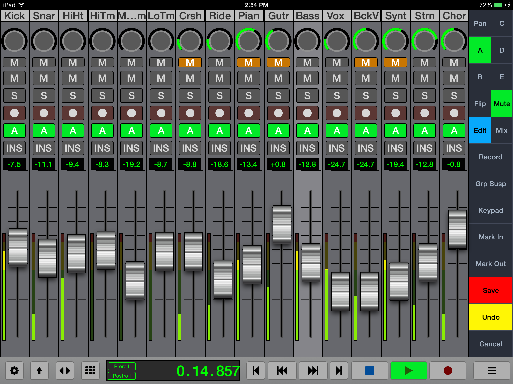
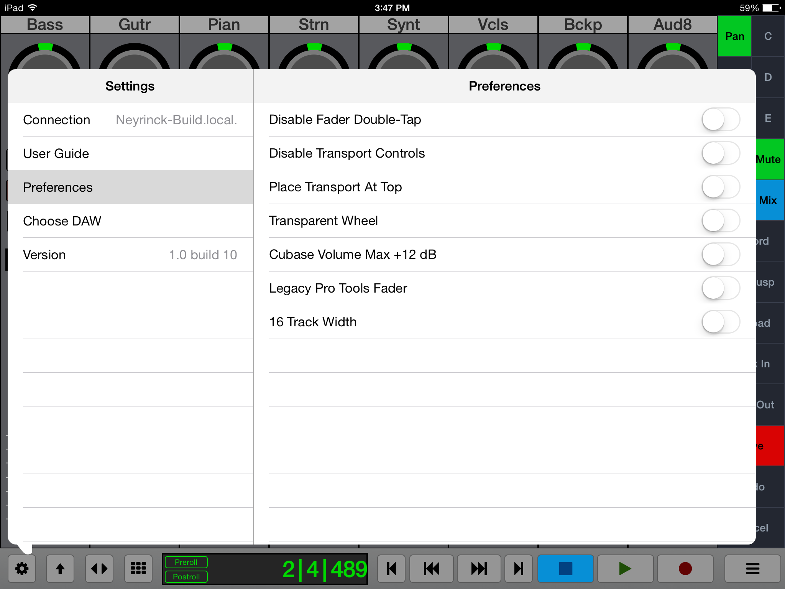
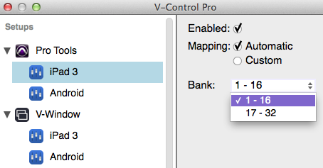
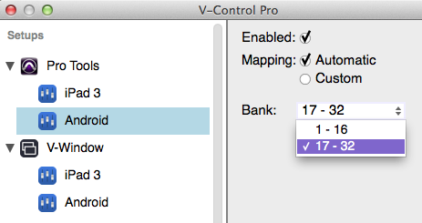

# Welcome to V-Console
V-Console runs on iPad to control software applications such as Pro Tools, Cubase, Logic Pro and many others.

## Features

* Control Fader Level and Stereo Panning per channel
* Control of Mute, Solo, and Track Arming per channel
* Edit Auxiliary Send Volume, including send muting and pre/post status
* Flip mode inverts functions of channel faders and rotary controls
* Select specific automation modes separately for each channel.
* Full Transport controls, jog wheel, and control of common transport related functions (loop, punch, online, etc.)
* Detailed time counter, small and large-sized versions (V-Console)
* Full editing commands panel, with large amount of shortcut controls completely customized for each specific D.A.W. platform.
* Quick access to Mark In and Mark Out points, and Marker creation and recall
* Automation write enable/disable for volume, pan, mute and send
* Works seamlessly with Raven MTi/MTx thanks to V-Control Pro 2’s ability to allow the use of MIDI controllers and mobile devices simultaneously.

## Quick Start Guide
* On your iPad, go to the App Store, and install the V-Console app.
* Open the V-Console app on your device and connect to your host computer.

* Installation And Setup
For information on Installation and Setup for the V-Control Pro go to the V-Control Pro Users Guide.

## Setting Up V-Console on an iPad device.

* Open the Settings in V-Console by touching the gear in the lower left hand corner.
* Select "Connection" from the Settings menu.
Touch "Change" and enter IP Address

* You can easily see what your IP Address is by clicking on the V-Control Pro app icon in the system tray and selecting "About V-Control Pro".
* Touch the IP Address on the "Connection" page of V-Console to connect to the computer.
* V-Console should now be connected with V-Control Pro on the host computer.

## Using the Wired Connection with V-Console
The native iPad version of V-Console has the capability of a hardwired connection to the computer with a USB cable.

Here is how to connect V-Console with a wired connection.

* Launch V-Control Pro on the host computer.
* Launch V-Console on the iPad
* Connect the iPad directly to the computer with a USB cable
* V-Console will now be connected automatically in Wired Connection mode.

NOTE: For Wired Connection on Windows PC, iTunes must be installed for iPad detection.

## General Troubleshooting
* Verify the device running V-Console is on the same network as the host computer running V-Control Pro.
* Verify that you have the host computer selected running V-Control Pro in the Connection section of the V-Console settings.
* Verify the host computer running V-Control Pro has a Computer name setup such as "John's Mac" in System Preferences / Sharing
* Verify that V-Control Pro sees the device running V-Console in the list of available devices.

## V-Console 16
With certain DAWs such as Pro Tools, Logic, and Cubase it is possible to control 16 tracks on a single screen with V-Console. This way you get double the amount of channel strips than you do in the regular mode.

Here is how to set up V-Console for 16 Tracks

Launch V-Console
Open the V-Console Settings Window
Go to Preferences and turn on the "16 Track Width"

V-Console should now open with a 16 track layout instead of the standard 8.

## Setting Up Banks for Multiple Devices
When using multiple devices, each device can be assigned to different banks.

Extended banks currently not available for Steinberg applications.

For V-Console in 8-track mode, the controller can be assigned to the following banks:

1-8
9-16
17-24
25-32
For V-Console in 16-track mode, the controller can be assigned to the following banks:

1-16
17-32
Here is how to assign different banks to a controller:

Launch V-Control Pro
Launch V-Console on a device and connect it to computer
Launch the DAW
Click on the V-Control Pro icon in the task bar and select "Setups.."
With the Setups window opened, select the controller linked with the DAW to display options for that controller
Click on the Bank drop down window to select which bank to use:
Here's how it would be setup for two controllers in 16 track mode.

Controller #1

Controller #2

The controller will now control the selected bank. Please ensure you have properly setup your DAW for use with multiple controllers. You can see the setups for V-Control Pro and DAWs HERE.

NOTE: When using multiple controllers, banking or moving channels left and right will affect all controllers. For example, if you have two controllers setup with one controlling banks 1-16, and the other controller 17-32, banking to the left or right on one controller will bank both simultaneously.

Back to top
V-Console iPhone
V-Console on the iPhone features a one track display with command buttons and transport control. Swipe left and right on the channel to navigate between tracks. Open the channel navigation pop-up to jump to a specific track by tapping on the track name.

## V-Window
V-Window has the ability to natively display and control D.A.W. plug-in windows, as well as other computer application windows, directly within V-Console.

Using this function, users are free to adjust an effect or instrument plug-ins directly from within V-Control, using a finger to drag and/or tap the assorted controls.

This process offers powerful new capabilities for adjusting a mix and tweaking effects, since it allows for plug-ins to be adjusted comfortably with one’s fingers, all while retaining the native plug-in interface carefully designed by the plug-in’s software authors.

Using V-Window

To use V-Window follow these steps.

Open the MultiPanel window, then select “V-Window” in the list of choices on the left side of the window.
Press the “select” button in the upper right hand corner off Window, to choose among all available computer windows to display and control.
The choices are organized first by computer application, and then from within the various windows within each application.
Select the specific window you wish to control, which in many cases would be the floating window of an effect or instrument plug-in.
The V-window interface will display a copy of the specifically selected computer window.
Touch the controls in the window, which will have the same effect as adjusting those controls with a mouse.
V-Window Operational Notes

In some cases, V-Window will see a new plug-in window automatically. However, it will occasionally go dark. If this occurs, simply tap the select button and re-select the specific window you wish to control.
V-Window is designed to be as responsive as possible to a mouse drag operation. This means that it does not respond to iPad-specific gestures such as pinch, drag, and double tap.
To adjust the area of the virtual window that can be seen and controlled, touch the “Adjust” button, which allows you to:
Drag the window in V-Control to see the desired content.
Pinch to enlarge or reduce the size of the window display.
When this action has been completed, touch the “Done” button.
Note that, when using V-Window, not only is the selected window displayed, but also all windows "above" it, allowing windows such as popup messages to be seen can be seen. This means that sometimes you may select a window, but will actually see a different window above.
If this occurs, simply tap on a section of the desired window to bring it forward in the V-Window.
V-Window can be viewed in full screen mode, letting you work with as much screen real estate as possible. This is done by tapping the diagonal arrows in the menu bar of V-Window.
NOTE: For optimal performance, V-Window should be used on only one device at a time.

NOTE: In the web app version of V-Console, the zoom function is not available.

