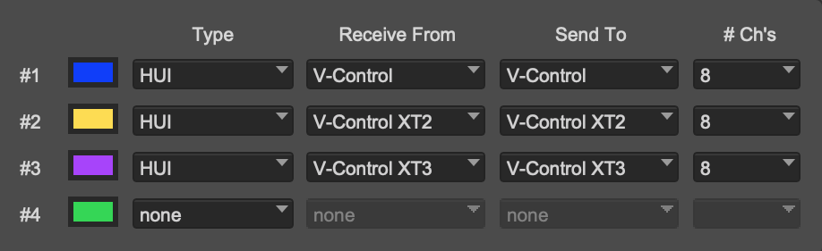

# Setting Up Pro Tools

V-Control Pro uses the HUI protocol with Pro Tools Studio/Ultimate to provide for 8, 16, 24, or 32 channels of control. The Pro Tools Midi Peripherals window must be configured to use V-Control Pro's virtual Midi ports for Pro Tools to communicate with V-Control Pro.

## Setting the Midi Peripherals

V-Control Pro must be set up in the Pro Tools peripherals window. Depending on how many banks are being used, the configuration will vary. 

* In the Pro Tools top menu bar select: Setup / Peripherals. Select the MIDI Controllers tab

### 8 Channel Surfaces

### 16 Channel Surfaces

### 24 Channel Surfaces

### 32 Channel Surfaces

