# Welcome To V-Control Pro
V-Control Pro is a Mac and Windows application that connects control surfaces to digital audio and video workstations. It connects surfaces such as D-Command, C24, Control 24, FaderPort to DAWs such as Pro Tools, Cubase, Logic Pro X and many others. It uses iLok licensing that can be activated on your computer or on an iLok USB key. It provides MIDI Mode for surfaces so that surface buttons, faders, and encoders can be mapped to any application that provides MIDI mapping.

[See the full compatibility list](https://neyrinck.com/vcpro-compatibility/){ .md-button }

# Quick Start Guide

#### Install And Run
Install and launch the V-Control Pro application on your computer as described in the 'Installing V-Control Pro' section.
#### Open The Setups Window
To do this on Windows, click on the V-Control Pro system tray item and select Setups… To do this on Mac, click on the V-Control Pro menu bar  item and select Setups…
#### Add A Control Surface
Add a control surface to the Controllers section of the Setups window. To do this, locate the Add New… text in the Controllers section. Click on Add New… and choose an item. See the Setting Up Controllers chapter to read the details of setting up the controllers supported by V-Control Pro.
#### If Using V-Console On iPad
If using the V-Console app as your surface, launch V-Console, go to Settings - Connection and select the DAW computer to connect to. See the Setting Up Controllers chapter for more information.
#### Launch Application To Be Controlled
Launch a supported media application for control such as Pro Tools, Logic Pro, Cubase, etc. See the Setting Up Media Applications chapter for all supported applications.
#### Configure Application For Control
In the media application, set it up to communicate with V-Control Pro.. If the application uses HUI or Mackie Control protocol, connect it to the appropriate V-Control pro virtual midi ports such as V-Control, V-Control XT2, etc. See the Setting Up Media Applications chapter to read the details of setting up the application for control

# Install And Run V-Control Pro

V-Control Pro is a desktop computer application that must be installed on the same computer that runs the DAW or media application to be controlled by a surface.

* Download Installer - Use a web browser to open the [Neyrinck Downloads Page](https://neyrinck.com/downloads/v-control-pro). Download the appropriate installer for your system.

* Launch Installer - Install and launch the V-Control Pro application on your computer as described in the 'Installing V-Control Pro' section.

* Run V-Control Pro - On Mac, use the Finder to go to the Applications folder. Locate V-Control Pro and double-click it. On Windows locate V-Control Pro and double-click it.

# V-Control Pro Licensing

V-Control Pro uses iLok licensing to enable its powerful features. A license can be activated on the computer running V-Control Pro or on an iLok USB key which makes it very easy to move the license between computers. You can [learn more at ilok.com](https://ilok.com).

V-Control Pro supports different licenses depending on your system requirements.

[See the license option list](https://neyrinck.com/vcpro-compatibility/){ .md-button }

#### Activating A License
When you purchase a license or you request a trial license, a license will be deposited to your iLok user account. To use a licensee, it must be activated. You can activate a trial or purchased license in two ways:

1. Activate A License Using V-Control Pro

    * Launch the V-Control Pro app on the host computer.

    * Select Activate License….

    * Select Activate when the license authorization prompt appears.

    * Enter the ilok ID and password used when purchasing the V-Control Pro license.

    * Select the V-Control Pro license to activate it and select Next.

    * Choose the location to place the license. V-Control Pro licenses can be activated directly on the computer or on an ilok USB key. An iLok USB key is most convenient because you can easily move it between computer systems.

2. Activate A License Using iLok License Manager
    * Launch the iLok License Manager application on the host computer.
    * Log in to your iLok user account.
    * Locate the V-Control Pro license.
    * Drag the license to your iLok or computer.

The V-Control Pro license will now be activated and V-Control Pro will operate with all supported features and functions.

#### Subscription Licenses
A V-Control Pro subscription license must be refreshed annually. The refresh is an automatic process that is done through an internet connection. If your computer does not have an internet connection, you must place the license on a computer that has an internet connection for it to be refreshed for the next monthly period. This has to be done once a year if your license is not on a computer that is connected to the internet. 
You can use the iLok License Manager or log in to your account on ilok.com to check on the expiration date for the license.

# Digidesign Control 24

First, you must add Control 24 as a controller in the V-Control Pro Setups window as described in [Setting Up Ethernet Controllers](#setting-up-ethernet).

##### Pro Tools
Set up Pro Tools for three HUI banks as described in [Setting Up Pro Tools](#setting-up-pro-tools).

##### Logic Pro X

Set up Logic Pro X for Control 24 as described in [Setting Up Logic Pro](#setting-up-logic).

##### Cubase/Nuendo

Set up Cubase / Nuendo for Control 24 as described in [Setting Up Cubase/Nuendo](#setting-up-cubase).

##### Ableton Live
##### Studio One
##### LUNA
##### MixBus
##### Digital Performer
Set up the DAW for Control 24 using three Mackie Control banks as described in [Setting Up Mackie Control](#setting-up-mackie).

Please see the Control 24 feature charts online at [Feature Charts – C24](https://neyrinck.com/help-category/v-control-pro-help/)

# Avid/Digidesign C|24

First, you must add C24 as a controller in the V-Control Pro Setups window as described in [Setting Up Ethernet Controllers](#setting-up-ethernet).

##### Pro Tools
Set up Pro Tools for three HUI banks as described in [Setting Up Pro Tools](#setting-up-pro-tools).

##### Logic Pro X

Set up Logic Pro X for C24 as described in [Setting Up Logic Pro](#setting-up-logic).

##### Cubase/Nuendo

Set up Cubase / Nuendo for C24 as described in [Setting Up Cubase/Nuendo](#setting-up-cubase).

##### Ableton Live
##### Studio One
##### LUNA
##### MixBus
##### Digital Performer
Set up the DAW for C24 using three Mackie Control banks as described in [Setting Up Mackie Control](#setting-up-mackie).

Please see the C24 feature charts online at [Feature Charts – C24](https://neyrinck.com/help-category/v-control-pro-help/)

# Digidesign Pro Control

V-Control Pro supports Pro Control Main and Faderpack devices. Up to four devices can be used, except for Logic where just one Main and one Faderpack can be used. First, you must add the Pro Control devices as controllers in the V-Control Pro Setups window as described in [Setting Up Ethernet Controllers](#setting-up-ethernet).

##### Pro Tools
Set up Pro Tools for 1, 2, 3, or 4 HUI banks as described in [Setting Up Pro Tools](#setting-up-pro-tools). Each Pro Control device counts as one 8-channel bank.

##### Logic Pro X
Set up Logic Pro X for Pro Control as described in [Setting Up Logic Pro](#setting-up-logic).

##### Cubase/Nuendo
Set up Cubase / Nuendo for Pro Control as described in [Setting Up Cubase/Nuendo](#setting-up-cubase).

##### Ableton Live
##### Studio One
##### LUNA
##### MixBus
##### Digital Performer
Set up the DAW for Pro Control using 1, 2, 3, or 4 Mackie Control banks as described in [Setting Up Mackie Control](#setting-up-mackie). Each Pro Control device counts as one 8-channel bank.

Please see the Pro Control feature charts online at [Feature Charts – Pro Control](https://neyrinck.com/help-category/v-control-pro-help/)

# Avid D-Command

V-Control Pro supports D-Command Main and Fader Module devices. Up to two devices can be used for 24 channels of control First, you must add the D-Command devices as controllers in the V-Control Pro Setups window as described in [Setting Up Ethernet Controllers](#setting-up-ethernet).

##### Pro Tools
Set up Pro Tools for 1 or 3 HUI banks as described in [Setting Up Pro Tools](#setting-up-pro-tools). A D-Command Main device counts as one 8-channel bank. A Fader module counts as two 8-channel banks.

##### Logic Pro X
Set up Logic Pro X for D-Command as described in [Setting Up Logic Pro](#setting-up-logic).

##### Cubase/Nuendo
Set up Cubase / Nuendo for D-Command as described in [Setting Up Cubase/Nuendo](#setting-up-cubase).

##### Ableton Live
##### Studio One
##### LUNA
##### MixBus
##### Digital Performer
Set up the DAW for D-Command using 1 or 3 Mackie Control banks as described in [Setting Up Mackie Control](#setting-up-mackie). Each eight strips counts as one 8-channel bank.

Please see the Pro Control feature charts online at [Feature Charts – Pro Control](https://neyrinck.com/help-category/v-control-pro-help/)

# FaderPort V2 / iOStation 24c

V-Control Pro supercharges the single fader FaderPort V2 / iOStation 24c for use with Pro Tools.

* It is VERY important the Faderport V2 / iOStation 24c is in Studio One Operation mode and NOT in HUI mode. This allows V-Control Pro to customize how FaderPort maps to Pro Tools.

* Add the device as a controller in the V-Control Pro Setups window as described in [Setting Up MIDI Controllers](#setting-up-midi).

* Configure V-Control Pro to map the FaderPort V2 / iOStation 24c to 8, 16, 24, or 32 channels.
    * Open the V-Control Pro Setups window.
    * Click on the Faderport/ioStation 24c that is paired with Pro Tools in the Setups column.
    * Select 32 Channels in the Bank selection if using the AVID Control App or Standalone.
    * Select 24 Channels in the Bank selection if using RAVEN or a 24 fader surface.
    * Select 8/16 Channels in the Bank selection if using an 8 or 16 fader surface.

* In the Pro Tools MIDI Input Devices Window, disable the Faderport. It is connected with V-control Pro and can cause conflict if enabled in Pro Tools as well.

* Set up Pro Tools for 1, 2, 3, or 4 HUI banks as described in [Setting Up Pro Tools](#setting-up-pro-tools). The number of HUI bank channels must match the number of channels configured in the previous steps.

##### Fast Focus and Refocus with FaderPort V2/iOStation 24c

With V-Control Pro, the FaderPort automatically focuses to any track you select. V-Control Pro can widen the bank up to thirty-two tracks for instant focus, and if it loses focus it immediately blinks the Channel button. Simply tap the blinking button to automatically ReFocus. Now you can select any track at any time for a focused FaderPort.
When selecting a track within the controlled bank range, the Faderport will Fast Focus to the selected track for control.
When selecting a track outside of the controlled banks, the Channel button will immediately blink on the Faderport. Press it to ReFocus to that track for control.
When a track is selected within the controlled banks, press the channel button to enable the wheel for navigation.

Please see the FAderPort V2 / ioSTation 24c feature charts online at [Feature Charts](https://neyrinck.com/help-category/v-control-pro-help/)

# Using MIDI Mode

V-Control Pro provides a virtual MIDI port named "V-Control MIDI Mode" that lets control surfaces send and receive MIDI CC messages to applications and plugins that provide custom MIDI mapping. At the time of this writing, Pro Control, Control 24, C24, and D-Command provide MIDI Mode.

When a surface is not connected to a DAW, V-Control Pro defaults the surface to MIDI mode.

Learn more about [MIDI Mode here](https://neyrinck.com/midimode/).

# Setting Up Ethernet Controllers

#### C24, Control 24, Pro Control, D-Command

For surfaces that use Ethernet to connect to a computer, follow these instructions to add a surface to V-Control Pro.

* Open the V-Control Pro Setups Window.
* Click on + Add New under the Controllers section and select Add Ethernet Device…
* With the Ethernet Browser window open, ensure the correct Network is selected that the surface is connected to.
* Wait up to ten seconds for the surface to be recognized. When it appears, select it and click Add.

# Setting Up Midi Controllers
#### Command 8, FaderPort, ioStation 24c

For surfaces that use MIDI to connect to a computer, follow these instructions to add a surface to V-Control Pro.

* Open the V-Control Pro Setups Window.
* Click on + Add New under the Controllers section. 
* Click on the item with the name of the Midi controller you are using. Now the surface should be shown in the Controllers section of Setups.
* Click on the surface in the Controllers section of Setups and set the Midi input and output ports that it is using. The ports might have been automatically set, but you should confirm the ports are correct.

# Setting Up Pro Tools

V-Control Pro uses the HUI protocol with Pro Tools Studio/Ultimate to provide for 8, 16, 24, or 32 channels of control. The Pro Tools Midi Peripherals window must be configured to use V-Control Pro's virtual Midi ports for Pro Tools to communicate with V-Control Pro.

#### Setting the Midi Peripherals

V-Control Pro must be set up in the Pro Tools peripherals window. Depending on how many banks are being used, the configuration will vary. 

* In the Pro Tools top menu bar select: Setup / Peripherals. Select the MIDI Controllers tab

#### 8 Channel Surfaces
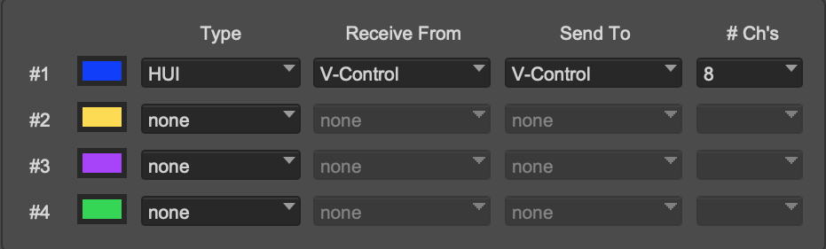</img>

#### 16 Channel Surfaces
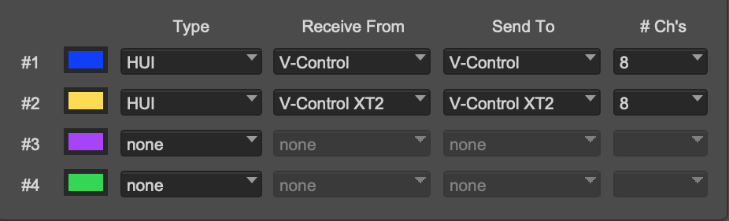</img>

#### 24 Channel Surfaces
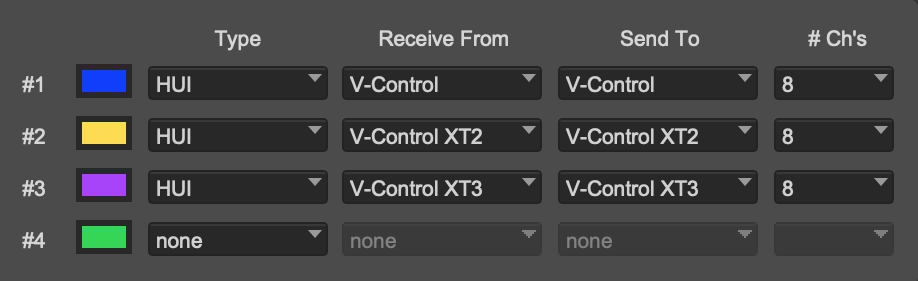</img>

#### 32 Channel Surfaces
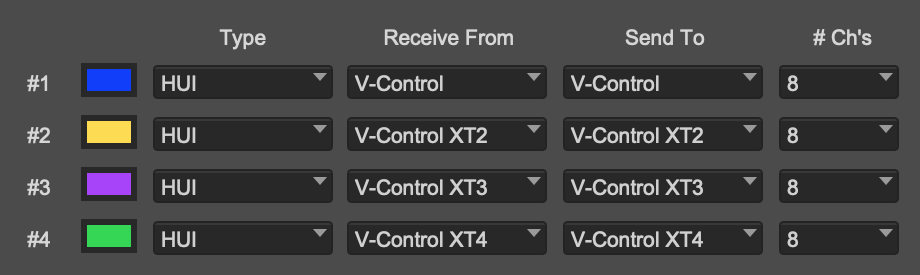</img>

# Setting Up Logic Pro X

Logic Pro will not be detected until it has connected to a control surface supported by V-Control Pro with Logic Pro. Follow these steps to connect it to a control surface.

* Open the V-Control Pro Setups window and make sure your surface has been added to the Controllers... section and it is actively detected.
* Launch Logic Pro
* Ensure "Automatic Installation" is enabled in the Control Surface setup in Logic.
* Logic automatically detects any controller setup through V-Control Pro. Click Connect when the automatic setup window pops up.
* Select "Add" when the window pops up saying it has detected Control Surface.
* V-Control Pro and Logic Pro should now have bidirectional communication.
* In some cases, Logic Pro will provide one-way communication. If that happens, follow these steps:
    * Quit Logic Pro.
    * Open the V-Control Pro Preferencess window. Toggle the "Logic Pro - Use IPv6" setting.
    * Launch Logic Pro. 

# Setting Up Cubase / Nuendo

* In the Steinberg top menu bar go to: Studio / Studio Setup...
* In the Studio Setup window, click on the "+" sign.

* Select the Control surface from the drop down list.
* Click Ok to close the Studio Setup Window.

# Setting Up Mackie Control DAWs

Many DAWs and media applications use the Mackie Control protocol to support control surfaces. V-Control Pro translates the Mackie Control protocol to several control surfaces that previously only worked with Pro Tools. These DAWs and media applications do not automatically detect surfaces and must be manually configured to use V-Control Pro's virtual MIDI ports. Configure the DAW/Media application to use one Mackie Control device,for the first 8 channels of control, with the V-Control MIDI port. Configure additional Mackie Control XT devices, with the V-Control XT2, XT3, and XT4 MIDI ports, for control surfaces that have 16, 24, or 32 channels.

* [Adobe Audition](#setting-up-audition)
* [Ableton Live](#setting-up-live)
* [Digital Performer](#setting-up-dp)
* [FMOD](#setting-up-fmod)
* [FL Studio](#setting-up-flstudio)
* [LUNA](#setting-up-luna)
* [MIO Console](#setting-up-mioconsole)
* [Mixbus](#setting-up-mixbus)
* [Premiere Pro](#setting-up-premiere)
* [Reaper](#setting-up-reaper)
* [Reason](#setting-up-reason)
* [Sonar](#setting-up-sonar)
* [Studio One](#setting-up-s1)
* [WWise](#setting-up-wwise)

## Studio One 
V-Control Pro must be set up in the External Devices window in the Studio One Preferences.  Depending on how many banks are being used, the configuration will vary.

#### 8 Channel Surfaces
Launch Studio One
In the Studio One top menu bar select: Studio One / Preferences...
Select External Device on the preferences window
Select "Add Device" and choose the following:
Mackie/Control
Receive From: V-Control
Send To: V-Control

</img>
#### 16 Channel Surfaces
Follow instructions for 8 Channel setup, then add the following:
Select “Add Device” and choose the following:
Mackie/Control
Receive From: V-Control XT2
Send to: V-Control XT2

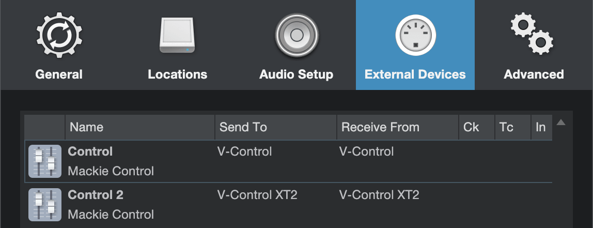</img>

(Optional) Rename the 2nd controller by selecting it and clicking on Edit…
Click on Placement and drag the devices

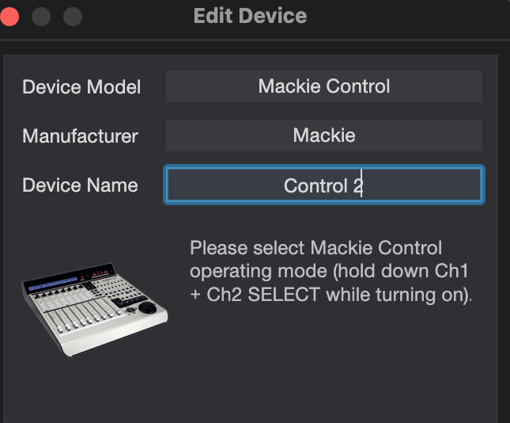</img>

Click on Placement and drag the devices from the Ungrouped section to Grouped in the desired configuration:

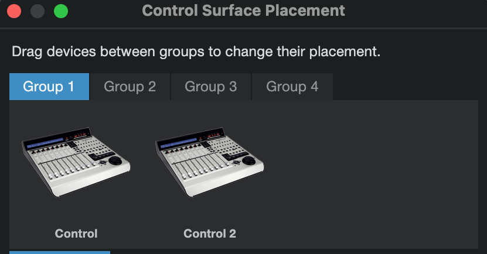</img>

#### 24 Channel Surfaces
Follow instructions for the 8 and 16 Channel setup, then add the following:
Select "Add Device" and choose the following:
Mackie/Control
Receive From: V-Control XT3
Send To: V-Control XT3

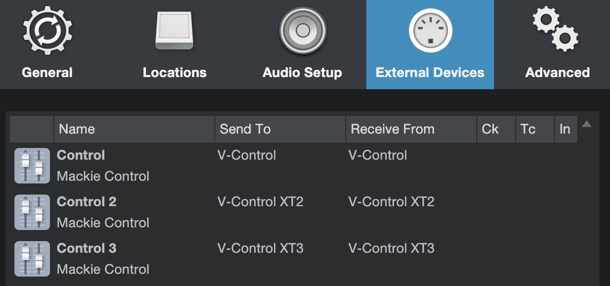</img>

(Optional) Rename the 3rd controller by selecting it and clicking Edit..

</img>

Click on Placement and move the controllers from the Ungrouped section to the Grouped section in the desired configuration.

</img>

## MixBus
V-Control Pro must be set up in the Control Surface Preferences window in MixBus.  Depending on how many banks are being used, the configuration will vary.
8 Channel 
Launch Mixbus
In the MixBus Audio/MIDI Startup window, make sure a MIDI System is selected. It can not be "None".
In the Mixbus top menu bar go to: Mixbus / Preferences
In the Preferences window, click on Control Surfaces and then click on the box next to  Mackie Control to enable it.
Click on Show Protocol Settings with Mackie Control selected to open the protocol setup window.
For Device type select Mackie Control and setup the ports as shown:
Main surface at position 1 sends via: V-Control
Main surface at position 1 receives via: V-Control

16 Channel
In the Mixbus top menu bar go to: Mixbus / Preferences
In the Preferences window, click on Control Surfaces and then click on the box next to  Mackie Control to enable it.
Click on Show Protocol Settings with Mackie Control selected to open the protocol setup window.
For Device type select Mackie Control with One Extender and setup the ports as shown:
Main surface at position 1 sends via: V-Control
Main surface at position 1 receives via: V-Control
Main surface at position 2 sends via: V-Control XT2
Main surface at position 2 receives via: V-Control XT2

24 Channel
In the Mixbus top menu bar go to: Mixbus / Preferences
In the Preferences window, click on Control Surfaces and then click on the box next to  Mackie Control to enable it.
Click on Show Protocol Settings with Mackie Control selected to open the protocol setup window.
For Device type select Mackie Control with Two Extenders and setup the ports as shown:
Main surface at position 1 sends via: V-Control
Main surface at position 1 receives via: V-Control
Main surface at position 2 sends via: V-Control XT2
Main surface at position 2 receives via: V-Control XT2
Main surface at position 3 sends via: V-Control XT3
Main surface at position 3 receives via: V-Control XT3

## Reaper 
V-Control Pro must be set up in the Control/OSC/Web section of the Preferences window. Depending on how many banks are being used, the configuration will vary.  At this time functionality is very limited with Reaper. 
8 Channel
Launch Reaper
In the Reaper top menu bar go to: Reaper / Preferences...
Navigate to the Control/OSC/Web section of the Preferences window.
Click on Add to bring up the Control surface setup window.
Select the following in the Control Surface Settings Window:
Control Surface Mode: Mackie Control Universal
MIDI Input: V-Control
MIDI Output: V-Control

16 Channel
Follow the instructions for 8 Channel setup then do the following.
Click on Add again to bring up a new window:
Select the following in the Control Surface Settings Window to add the 2nd bank:
Control Surface Mode: Mackie Control Extender
MIDI Input: V-Control XT2
MIDI Output: V-Control XT2
Surface Offset (Tracks): 8

24 Channel
Follow the instructions for 16 Channels then do the following:
Click on Add again to bring up a 3rd new window:
Select the following in the Control Surface Settings Window to add the 3rd bank:
Control Surface Mode: Mackie Control Extender
MIDI Input: V-Control XT3
MIDI Output: V-Control XT3
Surface Offset (Tracks): 16

## Digital Performer 
V-Control Pro must be set up in the Control Surface Setup window section of Digital Performer. Depending on how many banks are being used, the configuration will vary.
8 Channel
Launch Digital Performer
In the Digital Performer top menu bar go to: Setup / Control Surface Setup...
Configure the Control Surface Setup Window as followed:
Driver: Mackie Control
Unit: Mackie Control
Input Port: V-Control
Output Port: V-Control

16 Channel
Follow the instructions for 8 Channel setup then add the following:
Click on the + sign to add additional control surfaces.
Set the control surface as follows.
Unit: Expander (XT) Input: V-Control XT2-1 Output: V-Control XT2

24 Channel
Follow the instructions for 16 channel then add the following:
Set the control surface as follows.
Unit: Expander (XT) Input: V-Control XT3-1 Output: V-Control XT3

## Ableton Live
V-Control Pro must be set up in the MIDI Section of the Preferences Window.  Depending on how many banks are being used,  the configuration will vary.
8 Channel
In the Ableton Live top menu bar select: Ableton/Preferences…
In the preferences window, select Link/Tempo/MIDI
Select the following for the Control Surface Setup:
Control Surface: MackieControl
Input: V-Control
Output: V-Control

Toggle On for Remote for the following:
Input: MackieControl Input (V-Control)
Output: MackieControl Output (V-Control)
Control Surface: MackieControlXT
Input: V-Control XT2
Output: V-Control XT2
Control Surface: MackieControlXT
Input: V-Control XT3
Output: V-Control XT3
Toggle On for Remote for the following:
Input: MackieControl Input (V-Control)
Input: MackieControlXT Input (V-Control XT2)
Input: MackieControlXT Input (V-Control XT3)
Output: MackieControl Output (V-Control)
Output: MackieControlXT Output (V-Control XT2)
Output: MackieControlXT Output (V-Control XT3)
16 Channel
Follow the instructions for 8 Channel and do the following:
Add the addition row to the control surface setup:
Control Surface: MackieControlXT
Input: V-Control XT2
Output: V-control XT2

Toggle On for Remote for the following:
Input: MackieControl Input (V-Control XT2)
Output: MackieControl Output (V-Control XT2)
24 Channel
Follow the instructions for 8 Channel and 16 Channel and do the following:
Setup the following for the Control Surface Setup:
Control Surface: MackieControlXT
Input: V-Control XT3
Output: V-Control XT3
  

## LUNA
V-Control Pro must be set up in the Controllers Settings window section of the Preferences in LUNA. Depending on how many banks are being used, the configuration will vary.

#### 8 Channel
Launch LUNA
In the Luna top menu bar select: Luna/Preferences...
In the preferences window with the Settings showing, select Controllers

Select the following for the MIDI Control Surfaces:
Input Device: V-Control
Output Device: V-Control
Click on the box in the On column to enable control.

#### 16 Channel
Follow the instructions for 8 Channel and add the following
Select the following for the MIDI Control Surfaces:
Input Device: V-Control XT2
Output Device: V-Control XT2
Click on the boxes in the On column to enable control.

#### 24 Channel
Follow the instructions for 16 Channel and add the following:
Select the following for the MIDI Control Surfaces:
Input Device: V-Control XT3
Output Device: V-Control XT3
Click on the boxes in the On column to enable control.

## MIO Console

* In the MIO Console top menu bar select: MIO Console / Preferences...
* Click on the "Enable Control Surface Support" checkbox
* Select the following for Primary Controller:
From Controller: V-Control
To Controller: V-Control
* Select "Ok" to close the preferences window.

## Adobe Audition

* In the Audition top menu bar select: Audition Audition CC/Preferences/Control Surface...
* Select Device Class: Mackie
* Select Configure to open Configure Mackie Control window
* Configure Mackie Control as the following
Device Type: Mackie Control
MIDI Input Device: V-Control
MIDI Output Device: V-Control

Here is how to setup additional controllers for up to 32 tracks of control.

* * In the Configure Mackie Controller window, click on Add and set up as:
Device Type: Mackie Control XT
MIDI Input Device: V-Control XT2
MIDI Output Device: V-Control XT2
Repeat this step replacing V-Control XT2 with V-Control XT3 and V-Control XT4 for 32 tracks total.

NOTE: For the Channel/Bank Select buttons to function, there needs to be more created audio tracks in the session than the amount of tracks setup for V-Control Pro to control.

For example, if V-Control Pro is setup for 16 tracks of control in Audition, then there would need to be at least 17 created tracks in the session for the Channel/Bank select buttons to work.

## Premiere Pro 

* In the Premiere Pro top menu bar select: Premiere Pro/Preferences/Control Surface...
* Select Add for new Device Class
* Select Device Class: Mackie
* Select Settings... to open Device Class settings window
* Select Mackie in the settings window and select Edit
* Configure Mackie Control as the following
Device Type: Mackie Control
MIDI Input Device: V-Control
MIDI Output Device: V-Control

Here is how to setup additional controllers for up to 32 tracks of control simultaneously.

* * In the Configure Mackie Controller window, click on Add and set up as:
Device Type: Mackie Control XT
MIDI Input Device: V-Control XT2
MIDI Output Device: V-Control XT2
Repeat this step replacing V-Control XT2 with V-Control XT3 and V-Control XT4 for 32 tracks total.

NOTE: Some commands need to be manually mapped in Premiere Pro CC for full use. Go into the Button Assignments window in the Control Surface setup and assign the following:

Button: Flip - Command: Go To Previous Edit Point
Button: SMPTE/Beats - Command: Go To Next Edit Point
Button: Cycle - Command: cmd.audiomixer.loop
NOTE: For the Channel/Bank select buttons to work, there must be more audio tracks created in the current session than the number of tracks that are controlled by V-Control Pro. For example, if setup for 16 tracks of control, there must be at least 17 created audio tracks in Premiere for the Channel/bank select buttons to function.

## Reason Setup

* In the Reason top menu bar go to: Reason / Preferences...
* Select "Control Surfaces" in the preferences window.
* Click on "Add" and select the following:
Manufacturer: Mackie
Model: Control
Input: V-Control
Output: V-Control
*  Click "OK" to close window.

Here is how to add an additional controller device for when using a separate controller.

* Click on "Add" and select the following:
Manufacturer: Mackie
Model: Extender
Input: V-Control XT 2
Output: V-Control XT 2
* Click "OK" to close window.

Here is how to setup for V-Console 16 to have all 16 channels linked together:

* Click on "Add" and select the following:
Manufacturer: Mackie
Model: Combo, Extender Right
Control Input: V-Control
Extender Input: V-Control XT 2
Control Output: V-Control
Extender Output: V-Control XT 2

## Reaper

#### 8 Channel

* In the Reaper top menu bar go to: Reaper / Preferences...
* Navigate to the Control/OSC/Web section of the Preferences window.
* Click on Add to bring up the Control surface setup window.
* Select the following in the Control Surface Settings Window:
Control Surface Mode: Mackie Control Universal
MIDI Input: V-Control
MIDI Output: V-Control

</img>

#### 16 Channel

* Click on Add again to bring up a new window:
* Select the following in the Control Surface Settings Window to add the 2nd bank:
* Control Surface Mode: Mackie Control Extender
MIDI Input: V-Control XT2
MIDI Output: V-Control XT2
Surface Offset (Tracks): 8

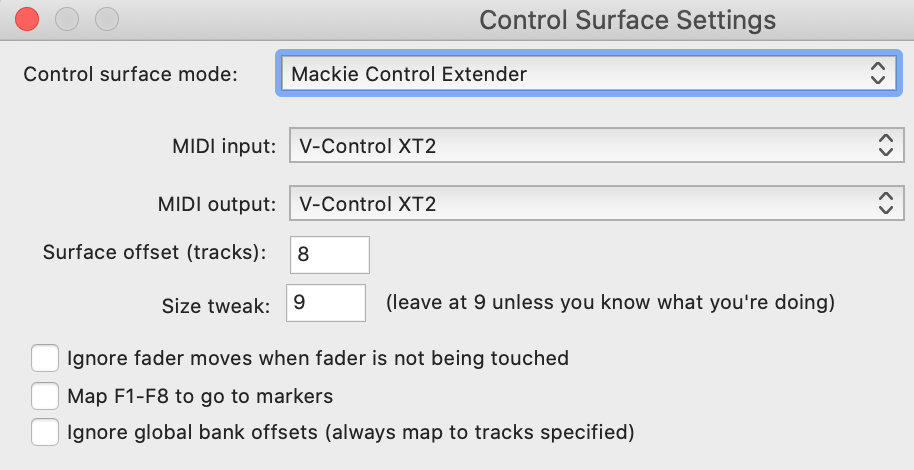</img>

#### 24 Channel

* Click on Add again to bring up a 3rd new window:
* Select the following in the Control Surface Settings Window to add the 3rd bank:
* Control Surface Mode: Mackie Control Extender
MIDI Input: V-Control XT3
MIDI Output: V-Control XT3
Surface Offset (Tracks): 16

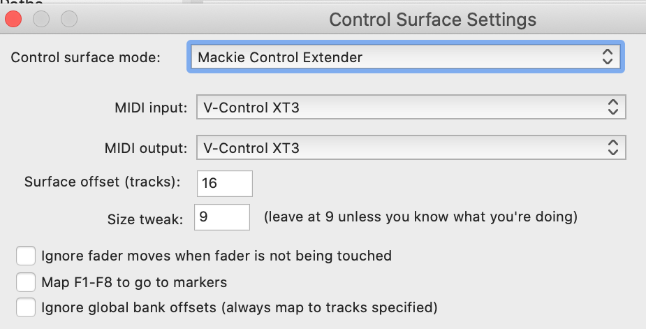</img>

## Tracktion

* Click on the "Settings" tab and select "MIDI Devices" on the side bar.
* Enable V-Control for the Input and Output.
* Select "Control Surfaces" on the side bar.
* Select "Mackie Control Universal and configure as follows:
Input Device: V-Control
Output Device: V-Control

## Sonar

* In the Sonar top menu bar go to: Edit / Preferences / Control Surfaces...
* Configure for Connected Controllers/Surfaces as follows:
Controller/Surface: Mackie Control
In Port: V-Control
Out Port: V-Control

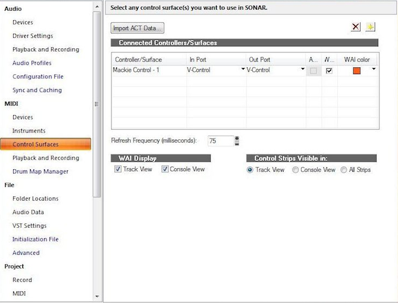</img>

## FL Studio

* Go To Options and select MIDI Settings (F10)
* Select V-Control Pro in the Input section and Enable. Choose Mackie Control Universal as Control Type.
* Select V-Control Pro in the Output section and Enable.
* Set the MIDI Input/Output Ports to 102 for V-Control Pro
* V-Console and FL Studio should now have bidirectional communication with each other.

NOTE: FL Studio only supports one device for setup. It is not possible to setup for more than 8 tracks of control through V-Control Pro.

## FMOD Studio

* In the FMOD Studio top menu bar select: FMOD Studio / Preferences...
* In the Preferences window, select the Control Surface tab.
* Select the following for an 8 channel surface:
Device Type: Mackie Control
Input Port: V-Control
Output Port: V-Control
FMOD Mackie 1

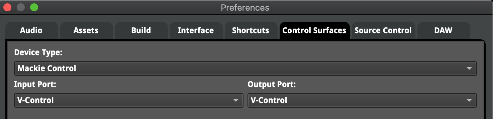</img>

* Select the following for an 16 channel surface:
Device Type: Mackie Control with Extender
Input Port: V-Control
Output Port: V-Control
Input Port 2: V-Control XT2
Output Port 2: V-Control XT2
FMOD Mackie 1

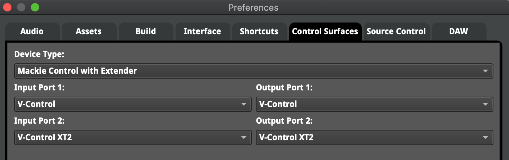</img>

## Wwise

* In the Wwise top menu bar select: Project / Control Surface Devices
Click on "Add.." in the Control Surface Devices Window
* In the Wwise top menu bar select: Project / Control Surface Devices
Type out a name for device being used with V-control Pro.
name

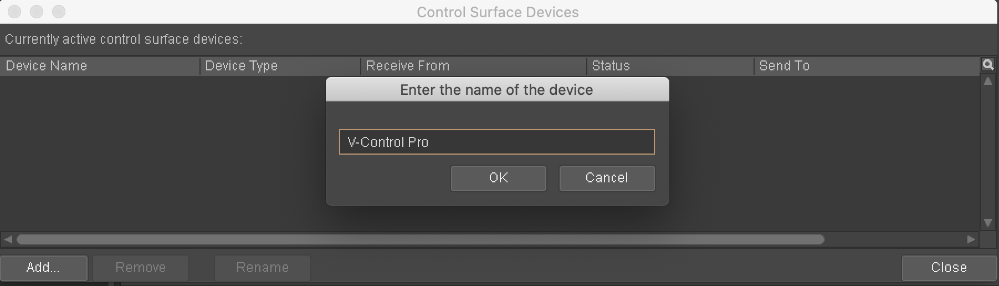</img>

* In the Wwise top menu bar select: Project / Control Surface Devices
* In the Wwise top menu bar select: Project / Control Surface Devices
Set the settings of the device as shown:
Device Type: Mackie Control
Receive From: V-Control
Send To: V-Control

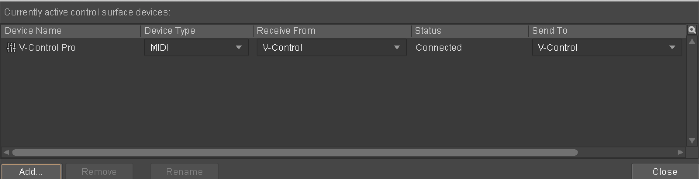</img>

## DaVinci Resolve

* In the Resolve top menu bar select: DaVinci Resolve / Preferences...
* In the Preferences window, select "Control Panels"
* In the Audio Console section, enable "Use MIDI audio console".
* Setup with with the following settings:
MIDI Protocol: HUI compatible
MIDI Input: V-Control
MIDI Output: V-Control

</img>
